# Nomad Books

[//]: # (TODO take screenshots to replace the ones removed from the readme)

[//]: # (![[ImmediatelyFast]&#40;https://modrinth.com/mod/immediatelyfast&#41;]&#40;https://img.shields.io/badge/dynamic/json?color=158000&label=downloads&prefix=+%20&query=downloads&url=https://api.modrinth.com/v2/project/5ZwdcRci&logo=modrinth&#41;)

[//]: # ([![img]&#40;https://img.shields.io/discord/292744693803122688?color=informational&label=Ladysnake&logo=Discord&#41;]&#40;https://ladysnake.glitch.me&#41;)

[//]: # ([![img]&#40;http://cf.way2muchnoise.eu/full_rats-mischief_downloads.svg&#41;]&#40;https://www.curseforge.com/minecraft/mc-mods/nomad-books&#41;)

[//]: # ([![img]&#40;http://cf.way2muchnoise.eu/versions/minecraft_nomad-books_latest.svg&#41;]&#40;https://www.curseforge.com/minecraft/mc-mods/nomad-books&#41;)

**Nomad Books** is a Minecraft Fabric mod that introduces a solution for players that are always adventuring around their world. Nomad books and pages allow these players to store their camp in the form of an item and redeploy it whenever and wherever they wish.

## Wiki

### Nomad Books

A nomad book is an item that can store a 3x1x3 sized camp. The book displays a campfire as indicator if the camp is deployed (campfire absent) or not (campfire visible).

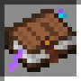
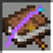

To **deploy** a camp simply find a flat spot with sufficient space blocked by nothing but plants (grass, flowers, vines,...) and snow and use the nomad book where you want the centre of your camp to be.

To **retrieve** a camp the player needs to be in a 10 block radius to the centre and use the book again. If you are too far away from the camp to retrieve it you can hold enderpearls in your offhand while using the book to teleport back to the centre of the camp at the cost of one enderpearl per 60 blocks of distance travelled.

Shift-using with the nomad books will reveal the boundaries of the camp.

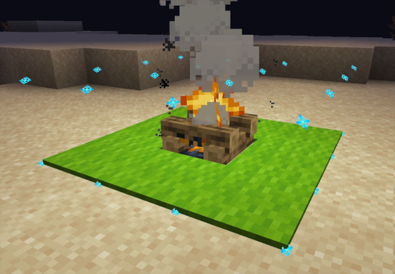

Default camp setup with boundaries toggled on.

### Obtaining

#### Nomad Books

Nomad Books can be crafted using three grass pages and a campfire. A single book is guaranteed in the bonus chest loot.

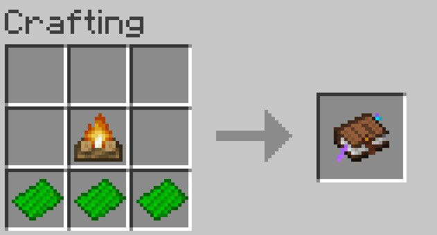

There will always be a Nomad Book appearing in the bonus chest (if enabled) at the start of the game.

#### Grass Pages

Grass pages - which allow the player to craft and upgrade nomad books - can be found with a **50%** chance in the loot chests of buried treasures, cartographer villagers,  dungeons, jungle temples, mine shafts and pillager outposts.

They can also be found in stronghold library chests in stacks of **0-3**.

Another way of obtaining grass pages is by dismantling Nomad Books in a crafting grid while the camp is deployed. For dismantling a Nomad Book the player will receive 3 grass pages for the book itself, 1 page per height upgrade and 2 pages per width upgrade as well as 1 page per special upgrade.

### Upgrading

Upgrades to the book can only be done while the camp is retrieved.

##### Dye

A book can be dyed using any dyes in the same way that armour can be dyed.

##### Height

A book's height can be upgraded by shapelessly combining it with **grass pages** in a crafting inventory. Despite there being no limit to the height of a camp, the higher it gets the more difficult the search for a good spot may be since not only space that is actually used must be emptied of obstacles.

##### Width

A book's width can be upgraded by using itinerant ink. Itinerant ink can be applied to a book by shapelessly combining it with a ghast tear, blue dye and charcoal.

Upon application, a goal will be decided depending on the current width size. Progress towards this goal is made by visiting biomes that the book hasn't been to yet. Note that it does **not** have to be a new **kind** of biome.

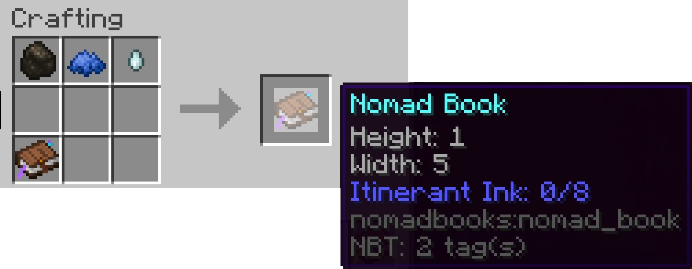

#### Special Upgrades

Special upgrades are upgrades that only have to be applied once to a book and add special properties to itself or the camp. Upgrades are applied by combining the book with a specific item in a crafting grid.

##### Aquatic Membrane Page

The Aquatic Membrane page (crafted as seen below) adds a membrane to your camp that will stop fluids from entering but lets the player as well as other entities pass, opening up the possibility to place your camp underwater!

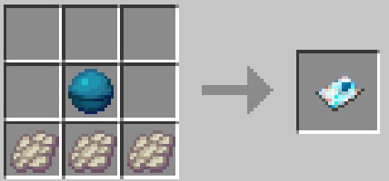

##### Mycelium Page

The Mycelium Page is a special page granting the Fungi Support upgrade. Fungi support allows the camp to be deployed on rough surfaces, as long as no obstacles interfere, by growing a special mushroom to fill up the missing floor blocks.

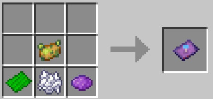

##### Spacial Displacer Page

The Spacial Displacer Page allows the camp to fit in small places. Moves terrain blocks from cramped spaces into a pocket dimension; The blocks return when the camp is retrieved. Configurable blacklist. Please don't use this to grief other players.

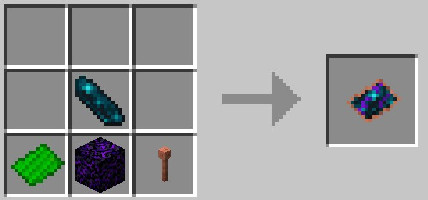

##### Nether Nomad Book

By combining the Nomad Book with a netherite ingot in an usual crafting grid the dropped item won't be destroyed in lava and instead swims up in it, similar to netherite ingots, tools and armour.

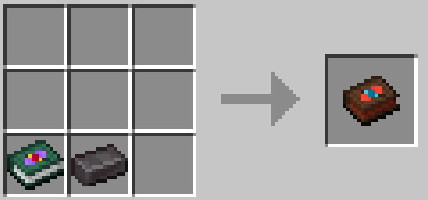

## Gallery

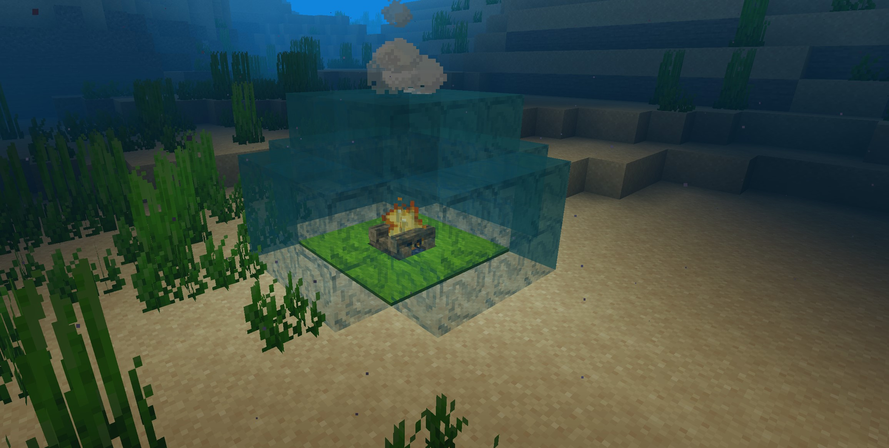

A view of  the aquatic membrane

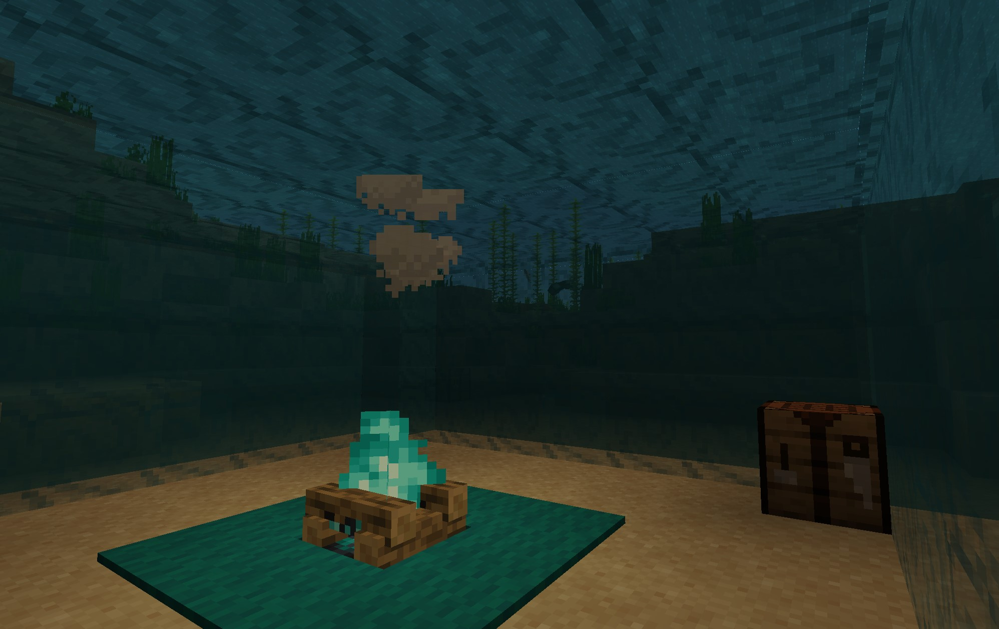

Inside a camp with aquatic membrane

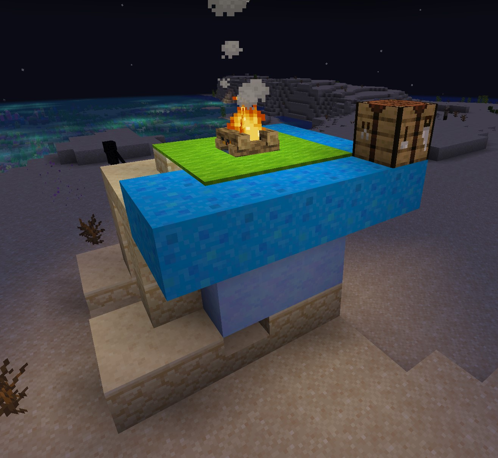

A camp on a desert well, held up by fungal support

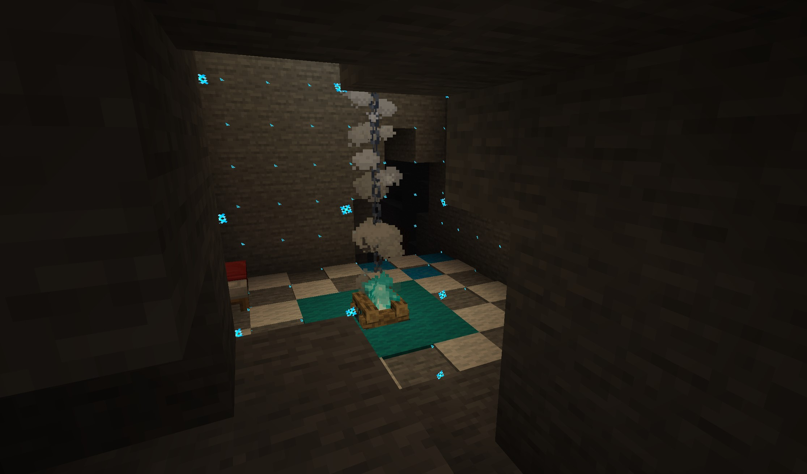

A camp with spacial displacer upgrade, placed in an otherwise too small cave

## Dev

### Getting Started

- `gradlew clean build`
- `gradlew genSourcesWithFernFlower`
- `gradlew runDatagen`

### How to Update or Port

1. Close other projects in Intellij
1. Update gradle [gradle docs](https://docs.gradle.org/current/userguide/upgrading_version_8.html): *eg.* `./gradlew wrapper --gradle-version 8.10.2`
1. Update loom [fabric dev](https://fabricmc.net/develop/) *search for "recommended loom version" in the page*
1. Update minecraft + fabric loader + fabric api + parchmentmc [fabric dev](https://fabricmc.net/develop/)
    - Update parchmentmc : org.parchmentmc.data:parchment-1.20.1:2023.09.03@zip (note migrateMappings is only useful for yarn) - [Getting Started](https://parchmentmc.org/docs/getting-started)
    - NOTE: Mojmap also can't migrateMappings
    - NOTE: fabricmc recommends Yarn but the community seems to be switching to mojmap. Mojmap is available for all mod loaders. good for multi-loader development.

## Licensing

The code is licensed under GPLv3.

The Art Is Licensed under Creative Commons BY-NC-SA (Creative Commons By Attribution-NonCommercial-ShareAlike).
The Original project art was licensed under All Rights Reserved, and so I am not using it. I have provided my own art for less restrictive use going forward.
